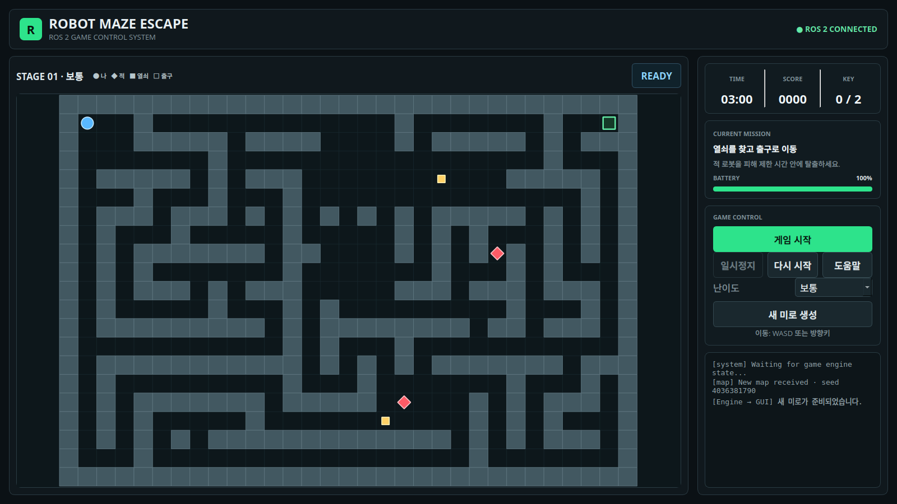

# Robot Maze Escape

ROS 2 Jazzy, C++17, Qt5로 만든 미로 탈출 게임이다. 화면과 게임 엔진을 서로 다른
ROS 2 노드로 분리했으며, 사용자 입력·게임 상태·재시작 요청이 실제 ROS 통신을
통해 오간다.



## 실행 구조

- `game_gui_node`
  - Qt 화면 표시와 키보드 입력 담당
  - `player_command` 토픽 발행
  - `game_state` 토픽 구독
  - `restart_game` 서비스 요청
- `game_engine_node`
  - 미로, 플레이어, 열쇠, 적, 점수, 시간, 배터리, 승패의 유일한 소유자
  - `player_command` 토픽 구독
  - `game_state` 토픽 발행
  - `restart_game` 서비스 제공

두 노드는 launch 파일에서 `/robot_maze` 네임스페이스로 실행된다.

## 빌드와 실행

```bash
cd /home/doyeon/colcon_ws
source /opt/ros/jazzy/setup.bash
colcon build --symlink-install --packages-select robot_maze_game
source install/setup.bash
ros2 launch robot_maze_game robot_maze.launch.py
```

## 조작

- 이동: `W A S D` 또는 방향키
- 일시정지/계속: `P`, `Space`, 또는 화면 버튼
- 목표: 열쇠 2개를 모은 뒤 초록색 출구 도착
- 실패: 적 충돌, 제한 시간 종료, 배터리 소진
- `다시 시작`: 현재 미로와 같은 시드로 초기화
- `새 미로 생성`: 새 시드로 미로 생성

난이도에 따라 제한 시간, 적 수, 배터리 소모 속도가 달라진다.

## 자동 검사

```bash
cd /home/doyeon/colcon_ws
source /opt/ros/jazzy/setup.bash
source install/setup.bash
colcon test --packages-select robot_maze_game
colcon test-result --verbose
```

검사 항목에는 미로 연결성, 결정론적 생성, 난이도별 적 수, 시작·일시정지,
벽 충돌, 같은 맵 재시작, 시간 종료, 배터리 종료가 포함된다.

## 주요 파일

- `ui/mainwindow.ui`: Qt Designer에서 편집하는 메인 화면
- `src/mainwindow.cpp`: 받은 ROS 상태를 화면에 표시
- `src/gui_ros_bridge.cpp`: Qt 화면과 ROS 통신 연결
- `src/game_engine.cpp`: ROS/Qt와 독립적인 게임 규칙
- `src/game_engine_node.cpp`: 게임 엔진을 ROS 노드로 노출
- `msg/`: 명령과 상태 사용자 정의 메시지
- `srv/RestartGame.srv`: 같은 미로/새 미로 재시작 서비스
- `launch/robot_maze.launch.py`: 두 노드 동시 실행
